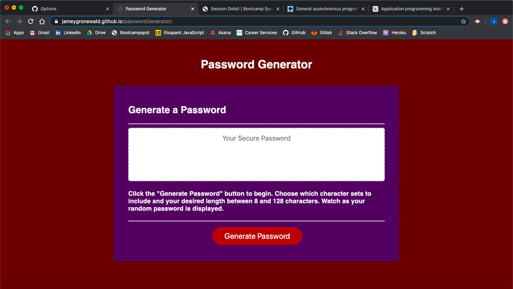
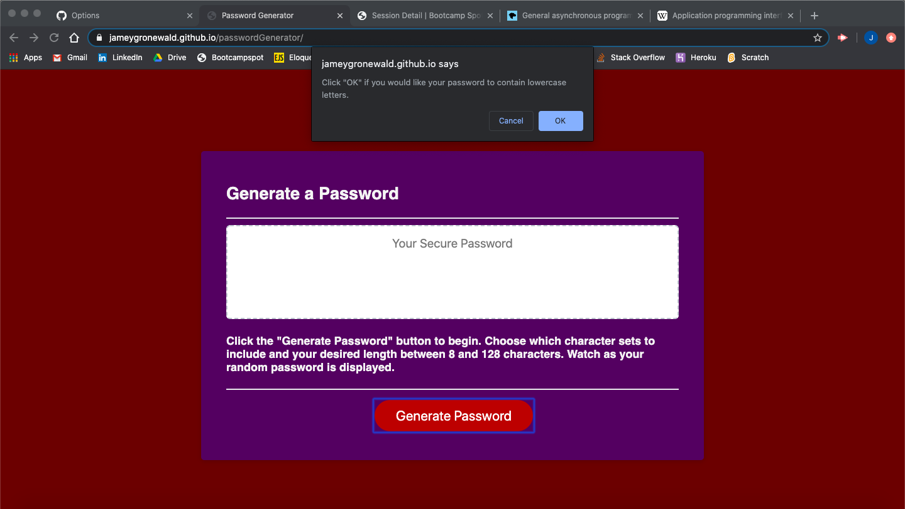
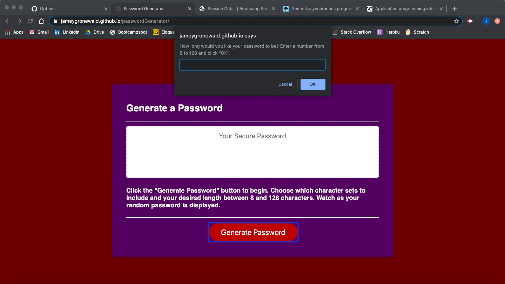
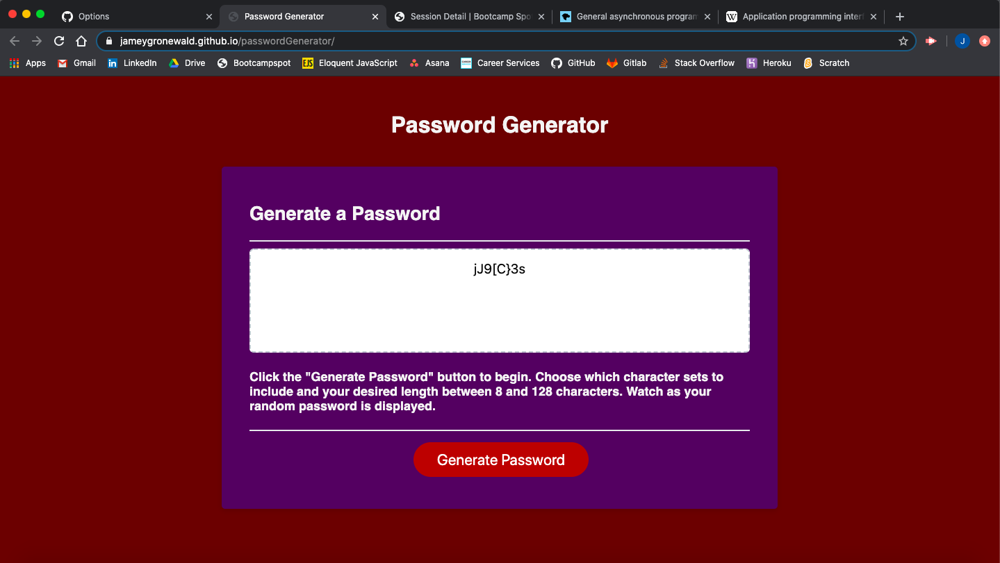

# Random Password Generator

Application that randomly generates passwords depending on user's desired length and character preference. 

---

## Description

Random Password Generator is a web app that creates random passwords for user's convenience. The user selects whether to include certain character sets (lowercase letters, uppercase letters, numeric characters, and/or special characters) as possible characters in the password, and selects the desired length between 8 and 128 characters for the password. Guarantees at least one of each desired character type in the returned password. The app has responsive functionality and is convenient for use in a mobile browser.

Users can create as many random passwords as desired at the push of a button. The program uses the confirm, prompt, and alert methods to guide user through password creation, and displays generated passwords to the user. 

---

## Table of Contents

* [Installation](#Installation)
* [Usage](#Usage)
* [Images](#Images)
* [Credits](#Credits)
* [License](#License)

---

## Installation

1. Clone the Github Repository [here](https://github.com/jameygronewald/passwordGenerator).
2. Open index.html in browser.

---

## Usage
* Visit the deployed app: [Jamey Gronewald Portfolio](https://jameygronewald.github.io/passwordGenerator/)
    1. Click "Generate Password" button to begin selecting preferences for randomly generated password
    2. Follow the prompts given by the app to select desired character sets and length of randomly generated password
    3. Watch as randomly generated password is displayed. Copy password to clipboard for personal use if desired.
    4. Click "Generate Password" button again and again to generate as many passwords as desired.

* Visit Github to track changes that were made or to clone the repo: [Github Repo](https://github.com/jameygronewald/passwordGenerator).

---

## Images

---

## Credits
I, Jamey Gronewald, was the sole creator of this project.

---

## License

MIT License

Copyright (c) [2020] [Jamey Gronewald]

Permission is hereby granted, free of charge, to any person obtaining a copy of this software and associated documentation files (the "Software"), to deal in the Software without restriction, including without limitation the rights to use, copy, modify, merge, publish, distribute, sublicense, and/or sell copies of the Software, and to permit persons to whom the Software is furnished to do so, subject to the following conditions:

The above copyright notice and this permission notice shall be included in all copies or substantial portions of the Software.

THE SOFTWARE IS PROVIDED "AS IS", WITHOUT WARRANTY OF ANY KIND, EXPRESS OR IMPLIED, INCLUDING BUT NOT LIMITED TO THE WARRANTIES OF MERCHANTABILITY, FITNESS FOR A PARTICULAR PURPOSE AND NONINFRINGEMENT. IN NO EVENT SHALL THE AUTHORS OR COPYRIGHT HOLDERS BE LIABLE FOR ANY CLAIM, DAMAGES OR OTHER LIABILITY, WHETHER IN AN ACTION OF CONTRACT, TORT OR OTHERWISE, ARISING FROM, OUT OF OR IN CONNECTION WITH THE SOFTWARE OR THE USE OR OTHER DEALINGS IN THE SOFTWARE.

